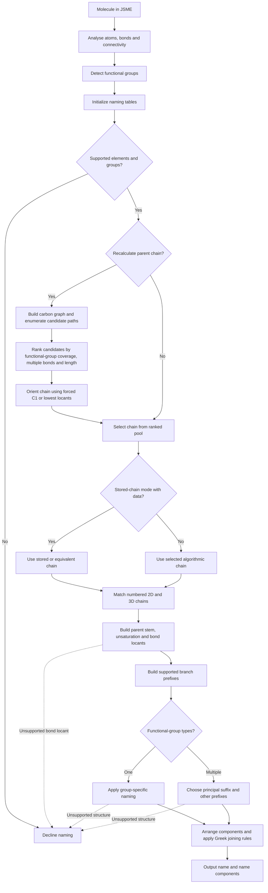

# Naming algorithm flowchart (v57)

High-level flow based on [mulermoc-nom-core-57.js](../js/mulermoc-nom-core-57.js).

```mermaid
flowchart TD
    A["Molecule in JSME"] --> B["Analyse atoms, bonds and connectivity"]
    B --> C["Detect functional groups"]
    C --> D["Initialize naming tables"]
    D --> E{"Supported elements and groups?"}
    E -- No --> X["Decline naming"]
    E -- Yes --> F{"Recalculate parent chain?"}

    F -- Yes --> G["Build carbon graph and enumerate candidate paths"]
    G --> H["Rank candidates by functional-group coverage, multiple bonds and length"]
    H --> I["Orient chain using forced C1 or lowest locants"]
    I --> J["Select chain from ranked pool"]
    F -- No --> J

    J --> K{"Stored-chain mode with data?"}
    K -- Yes --> L["Use stored or equivalent chain"]
    K -- No --> M["Use selected algorithmic chain"]
    L --> N["Match numbered 2D and 3D chains"]
    M --> N

    N --> O["Build parent stem, unsaturation and bond locants"]
    O --> P["Build supported branch prefixes"]
    P --> Q{"Functional-group types?"}
    Q -- One --> R["Apply group-specific naming"]
    Q -- Multiple --> S["Choose principal suffix and other prefixes"]
    R --> T["Arrange components and apply Greek joining rules"]
    S --> T
    T --> U["Output name and name components"]

    O -. "Unsupported bond locant" .-> X
    R -. "Unsupported structure" .-> X
    S -. "Unsupported structure" .-> X
```
